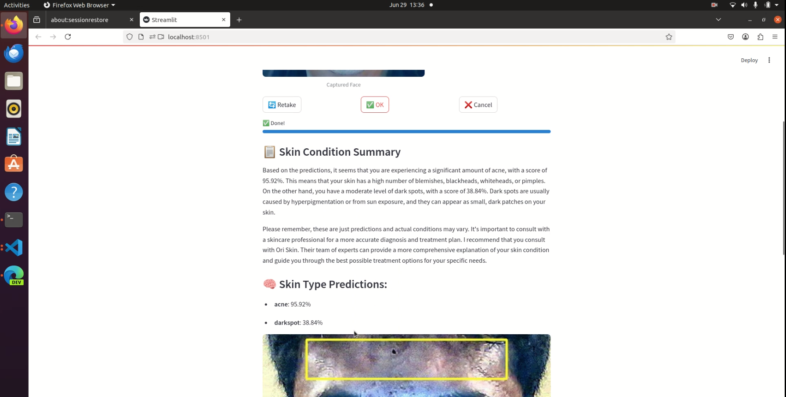

# Skin Analyzer Prototype – Project Summary

The Skin Analyzer is an AI-powered prototype designed to assess facial skin conditions in real-time through webcam input. Developed using Streamlit, OpenCV, and TensorFlow Lite, this application demonstrates how computer vision and deep learning can be applied to create an accessible and intelligent personal health diagnostic tool. Users can simply face their webcam, capture an image, and receive both visual detection and a natural language summary of their skin condition within seconds.

The system employs a dual-model pipeline: a lightweight object detection model detects visible skin issues, such as acne, dark spots, wrinkles, oily, and dry areas, while a Keras-based classification model evaluates the overall skin type. These models are trained on datasets sourced from open-source platforms (Kaggle) where it mainly contains (oily, acne, dry, and normal skin type), but enhanced through manual labeling to ensure high-quality annotations for both detection and classification tasks. This manual effort allowed for more precise training, especially on underrepresented skin conditions.

Captured facial images are automatically enhanced through adaptive contrast, sharpening, and color correction to optimize model performance. However, it’s important to note that the accuracy of predictions significantly improves in well-lit environments, as proper lighting contributes to clearer feature visibility and more consistent detection results. User can retake, cancel, or confirm to start analyzing the captured facial image.

To make the analysis accessible to non-technical users, the prototype integrates OpenAI’s GPT-4 to generate a personalized and easy-to-understand textual summary. This summary not only explains the condition detected but also recommends consulting with skincare professionals for personalized advice. The visual output includes bounding boxes and legends that help users identify and interpret the affected areas.

## Prototype Overview

